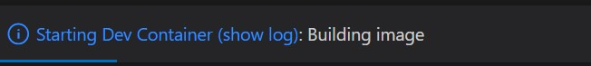

# Codespaces local development

As per the [documentation](https://docs.github.com/en/codespaces/overview), "A codespace is a development environment that's hosted in the cloud". Yet... that is a good idea that I likely could benefit from locally. It would be great to develop locally in the same way. And there is such a way!

My setup is:

- Great hardware!
- Windows 11
- [Docker with the WSL 2 backend](https://docs.docker.com/desktop/windows/wsl/)
- Latest [Visual Studio Code](https://code.visualstudio.com/Download)
- The [GitHub Codespaces](https://marketplace.visualstudio.com/items?itemName=GitHub.codespaces) extension

Create a [`devcontainer.json`](https://code.visualstudio.com/docs/remote/devcontainerjson-reference) file in a "`.devcontainer`" folder. Afterward, start Visual Studio code from that folder, or open the folder (using `File -> Open Folder...`). You will see a dialog at that corner like the one below, asking if you want to reopen in a container.


Press the button to "Reopen in Container", and that is it! A mechanism to avoid having to press that button every time, at least when opening a folder from the command line, is to install the [devcontainer command line interface](https://code.visualstudio.com/docs/remote/devcontainer-cli). That enables starting Visual Studio Code connected to the defined container using the command line: `devcontainer open [folder]`

While the container is being built and started, you can show the log.



There are examples under the folder [`2021-11.experiments.Codespaces.local`](./2021-11.experiments.Codespaces.local/). Just start Visual Studio Code from each folder.

- [`build.dockerfile`](./2021-11.experiments.Codespaces.local/build.dockerfile/): builds a Dockerfile based on Ubuntu distribution and install some dev tools.
- [`run.image`](./2021-11.experiments.Codespaces.local/run.image/): downloads a common NVIDIA image and starts the container with parameters to use GPUs.

Start a terminal window and try the `whoami` command to see the different behaviors. Cross-marketing some other experiments: another command that clearly shows the differences is the `nvidia-smi` (see information from the experiment [AI, CUDA, and the Hardware Connection](https://github.com/alissonsol/experiments/blob/main/2021/2021-11.experiments.CUDA.md)). If PowerShell is installed, it can be started with `pwsh`. You can try the [Yuruna](https://github.com/alissonsol/yuruna) framework in a container! Other [requirements](https://github.com/alissonsol/yuruna/blob/main/docs/requirements.md) may be needed, but there are instructions on how to setup those in a [Ubuntu](https://github.com/alissonsol/yuruna/blob/main/docs/ubuntu.md) environment.

Developing using a local Codespace may demand some ramp-up to become familiar with the functionality. Visual Studio Code is aware of changes you make to the enlistments inside the started containers. That can be both convenient and confusing. Check the [documentation](https://code.visualstudio.com/docs/remote/codespaces) for more information.

**NOTE**: Please read the documentation on [Remote Development Tips and Tricks](https://code.visualstudio.com/docs/remote/troubleshooting). Even when developing locally, there is "remote" connection to the container. It is recommended to enter these commands for [Resolving Git line ending issues in containers (resulting in many modified files)](https://code.visualstudio.com/docs/remote/troubleshooting#_resolving-git-line-ending-issues-in-containers-resulting-in-many-modified-files).

```shell
git config --global core.autocrlf input
git config --global core.autocrlf false
git resolve *
```

## Troubleshooting

### Container name already in use

- Check the existing names in use with `docker container list -a` or `docker ps -a`
- Delete a conflicting existing container using `docker rm [name]`

More to come...

The Alisson Sol [experiments](https://github.com/alissonsol/experiments) - Circa 2021/11
