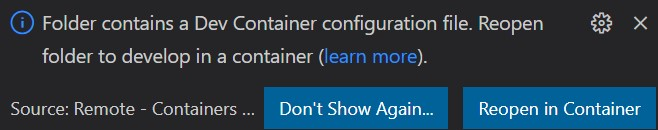

# Codespaces local development

As per the [documentation](https://docs.github.com/en/codespaces/overview), <em>"A codespace is a development environment that's hosted in the cloud"</em>. Yet... that is good idea that I likely could benefit from locally. It would be great to be able to develop locally in the same way. And there is such a way!

My setup is:

- Great hardware!
- Windows 11
- [Docker with the WSL 2 backend](https://docs.docker.com/desktop/windows/wsl/)
- Latest [Visual Studio Code](https://code.visualstudio.com/Download)
- The [GitHub Codespaces](https://marketplace.visualstudio.com/items?itemName=GitHub.codespaces) extension

That available, you need to create a [`devcontainer.json`](https://code.visualstudio.com/docs/remote/devcontainerjson-reference) file in a "`.devcontainer`" folder. Afterwards, start Visual Studio code from that folder. You will see a dialog at that corner like the one below, asking if you want to reopen in a container.

Press the buttom to "Reopen in Container" and that is it! You have an example in the folder [`2021-11.experiments.Codespaces.local`](./2021-11.experiments.Codespaces.local/). Just start Visual Studio Code from that folder. More to come...

The Alisson Sol [experiments](https://github.com/alissonsol/experiments) - Circa 2021/11
