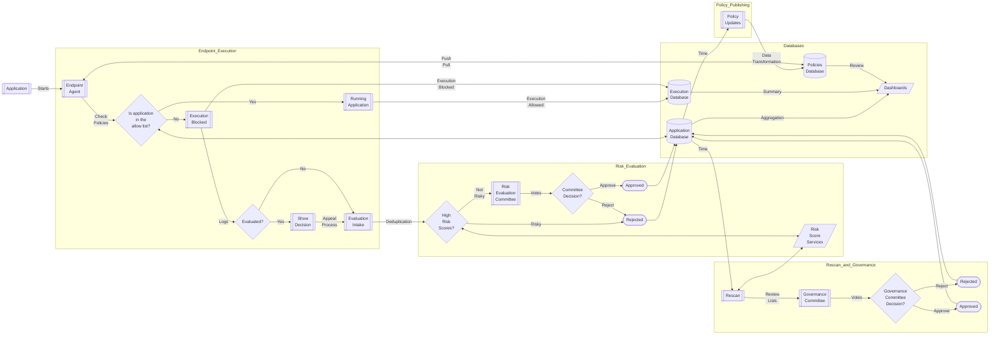
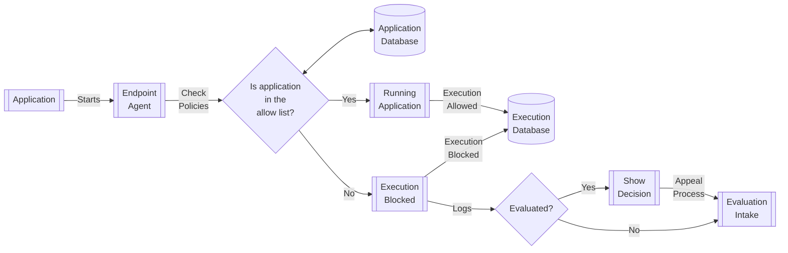
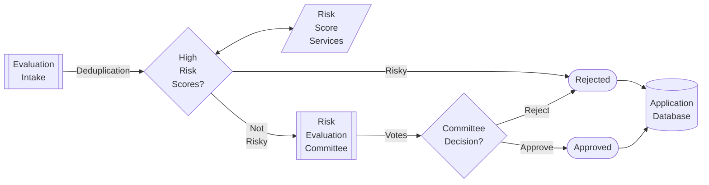
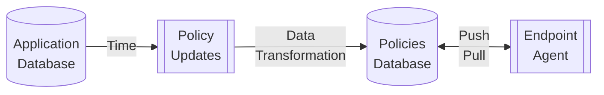
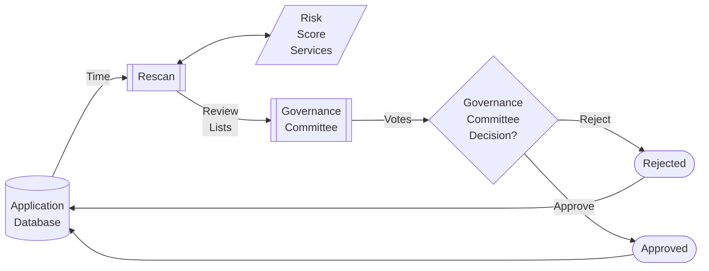

# Application allow list enforcement

Complimentary mermaid diagrams to the blog post [Application allow list enforcement](https://alissonsol.blogspot.com/2025/10/application-allow-list-enforcement.html). If the diagrams are shown as text due to the GitHub plug-in not working for your machine, please copy and paste the diagram to sites like [Mermaid.Live](https://mermaid.live/).

## High-level workflow for allow list maintenance

The workflow for [Figure 1](https://alissonsol.blogspot.com/2025/10/application-allow-list-enforcement.html)

## Endpoint execution workflow

The workflow for [Figure 2](https://alissonsol.blogspot.com/2025/10/application-allow-list-enforcement.html)

## Risk evaluation workflow

The workflow for [Figure 3](https://alissonsol.blogspot.com/2025/10/application-allow-list-enforcement.html)

## Policy publishing workflow

The workflow for [Figure 4](https://alissonsol.blogspot.com/2025/10/application-allow-list-enforcement.html)

## Rescan and governance workflow

The workflow for [Figure 5](https://alissonsol.blogspot.com/2025/10/application-allow-list-enforcement.html)

