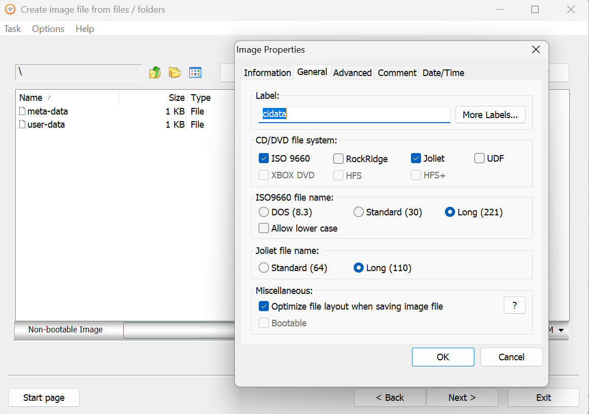
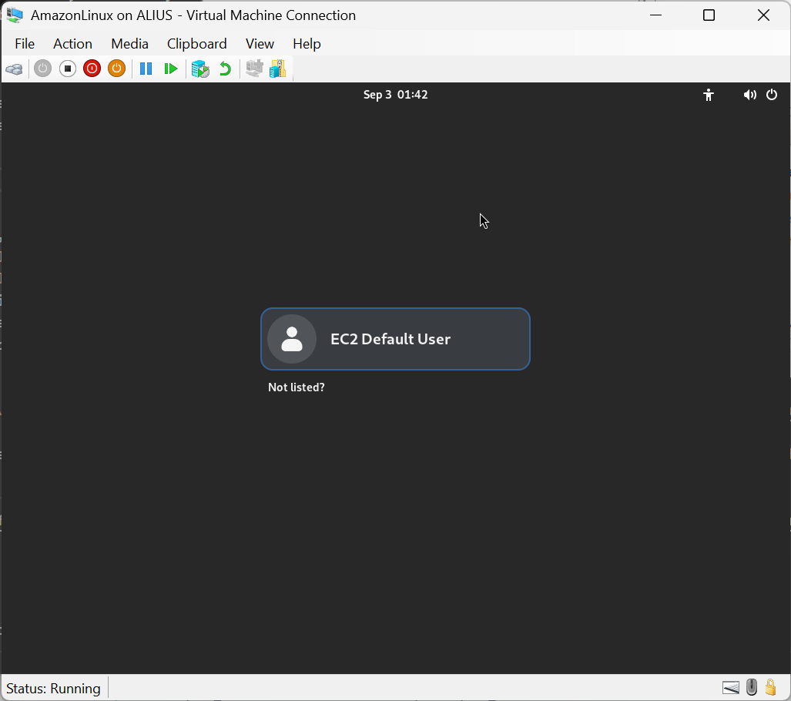

# Setup an Amazon Linux Developer VM on premises

Setup instruction for software development - Copyright (c) 2019-2026 by Alisson Sol

## 1) Getting the Amazon Linux up and running

This is an update of a previous effort that used [Amazon WorkSpaces](https://github.com/alissonsol/archive/tree/main/WorkSpaces/2019-03.WorkSpaces.AmazonLinux.setup). See [requirements and limitations](https://docs.aws.amazon.com/linux/al2023/ug/hyperv-supported-configurations.html). Instructions here were tested using Amazon Linux 2023 (not Amazon Linux 1 or Amazon Linux 2). Unless instructions indicate it differently, commands and environment variables used are from [PowerShell](https://github.com/powershell/powershell).

### 1.a) Downloading the latest files

<mark>SHORTCUT: The steps below (1.a) have been automated in the PowerShell script [`amazon.linux.hyper-v.download.ps1`](./amazon.linux.hyper-v.download.ps1).</mark>

Ready? Proceed to the download [site](https://docs.aws.amazon.com/linux/al2023/ug/outside-ec2-download.html). Click the link to the [cnd.amazonlinux.com](https://cdn.amazonlinux.com/al2023/os-images/latest/), and get to the `hyperv` subfolder. There will be large `vhdx.zip` file, which is the one to download. A hint here: you can see by the long file name that this image is being constantly updated. I usually keep the ZIP file copied nearby. Then, I unzip the content, while copying to `$env:ProgramData\Microsoft\Windows\Virtual Hard Disks`. Used to be `$env:Public\Documents\Hyper-V\Virtual hard disks`, but why would Microsoft keep locations stable when those updating Markdown files need a job?!

### 1.b) Creating the `seed.iso` file

The folder [`seedconfig`](./seedconfig/) in this repository has examples for the `-data` files. The repository also has a ready to use binary [`seed.iso`](./seed.iso) file. See the default password for the default user `ec2-user` in the [`user-data`](./seedconfig/user-data) file. You will be asked to change the default password for the default user after the first login. This is likely not the big security risk you will face today!

After any metadata changes, you need to recreate the file `seed.iso`, with the volume label `cidata`. This file packs the metadata files as per instructions [here](https://docs.aws.amazon.com/linux/al2/ug/amazon-linux-2-virtual-machine.html). Which would be reasonable instructions, if someone using Windows Hyper-V had the Linux and macOS tools!

The automation-friendly solution is to [Download and install the Windows ADK](https://learn.microsoft.com/en-us/windows-hardware/get-started/adk-install), using the command line tool `oscdimg`, which has clear command line [parameters](https://learn.microsoft.com/en-us/windows-hardware/manufacture/desktop/oscdimg-command-line-options) (Irony!).

<mark>SHORTCUT: For `vmcreate.ps1` to automate the `seed.iso` creation your need to [Download and install the Windows ADK](https://learn.microsoft.com/en-us/windows-hardware/get-started/adk-install) and double-check the path to `oscdimg` in line 19 of [`vmcreate-common.psm1`](./vmcreate-common.psm1)</mark>

Another option, which now means you shouldn't use `vmcreate.ps1` (or adapt it) is to use CD creation software like [AnyBurn](https://anyburn.com/). You then just add the files `meta-data` and `user-data` with the configurations of your choice, and don't forget the volume label (see picture).



### 1.c) Creating the VM

<mark>SHORTCUT: If you are considering creating multiple VMs, jump to section 3.a now.</mark>

It may be a good ideal to browse through the remaining of section 1 and through section 2 to see how many steps the script to create multiple VMs will save. Yet, do not create a single VM and later execute the scripts to create multiple VMs: the baseline Virtual Hard Disk may be changed already at that point. If changing approaches, consider downloading it again, using the script from step 1.a.

A possible reason not to go and use the script to create multiple VMs, even if creating a single one: it will creata a copy of the large baseline baseline Virtual Hard Disk file, what doesn't happen if following the manual or automated steps in the path to section 3.

<marK>SHORTCUT: The steps below (1.b) have been automated in the PowerShell script [`amazon.linux.hyper-v.create.ps1`](./amazon.linux.hyper-v.create.ps1).</mark>

Next, I go to the `Hyper-V Manager` and selecting the local server, righ-click and select the menu `New` -> `Virtual Machine...`:
- Under `Specify Name and Location`, enter whatever name you prefer (suggested: `AmazonLinux`), and leave the default location.
- Under `Specify Generation`, select `Generation 2`
- Under `Assign Memory`, select the `Startup Memory` (at least 8192, with 16384 or more recommended). Unselect `Use Dynamic Memory for this virtual machine.`
- Under `Configure Networking`, select the `Connection` as `Default Switch`.
- Under `Connect Virtual Hard Disk`, select `Use an existing virtual hard disk`. Browse to the file you previously unzipped, and click `Finish`.
- Right-click the new VM and choose `Settings`, to adjust configuration.
  - In the `Settings` window, under `SCSI Controller`, choose `DVD Drive`, then `Add`. Choose `Image file` and then browse to the `seed.iso` file and select it.
  - Under the `Security` section, unselect the `Enable Secure Boot` option.

Apply the changes. You can now start the VM, as per the instructions to [Run AL2 as a virtual machine on premises](https://docs.aws.amazon.com/linux/al2/ug/amazon-linux-2-virtual-machine.html). Unless you changed the defaults in the file `user-data`, you will login with the `ec2-user` account and the password defined there, and be promptly asked to change the password.

### 1.d) Network checks!

Before proceeding, check network connectivity. A simple command like `ping 8.8.8.8` should check if the network is connected. Then `ping google.com` would check if the DNS service client stack is working.

If something is not working, check if the machine got an IP address with the `ifconfig` command. If that is not working, you may try to change the settings for the `Network Adapter` virtual switch (more [here](https://learn.microsoft.com/en-us/windows-server/virtualization/hyper-v/get-started/create-a-virtual-switch-for-hyper-v-virtual-machines)).

After each change you can bring network connection down and up again and check connectivity. Example below for `eth0`.

```
sudo ip link set dev eth0 down
sudo ip link set dev eth0 up
ifconfig
ping 8.8.8.8
```

<mark>CHECKPOINT: This is a great time to create a checkpoint `OS Installed`. Your system should reboot to a command line. Yet, it may save time.</mark>

## 2) Install Tools

<mark>SHORTCUT: The steps below (2.a, 2.b, 2.c, 2.d, and 2.e) have been automated in the Bash script [`amazon.linux.tools.bash`](./amazon.linux.tools.bash).</mark>

After the first login after the OS is installed, execute the commands below and jump to 2.f.

```
curl -o amazon.linux.tools.bash https://raw.githubusercontent.com/alissonsol/experiments/refs/heads/main/2025/2025-09.amazon.linux.hyper-v/amazon.linux.tools.bash
chmod a+x amazon.linux.tools.bash
sudo bash amazon.linux.tools.bash
```

### 2.a) Install the GUI

Update the system, install the GNOME Desktop environment, and shutdown.

```
sudo dnf update -y
sudo dnf upgrade -y
sudo dnf groupinstall "Desktop" -y
sudo shutdown now
```

<mark>CHECKPOINT: This is a great time to create a checkpoint `GUI Installed`. Your system should reboot to a GUI, and you should be able to start a terminal and a browser. Or you may wait until all tools are installed.</mark>



### 2.b) Install the JDK

The Java toolk to be used in the [Amazon Corretto](https://docs.aws.amazon.com/corretto/)

```
sudo dnf install -y java-21-amazon-corretto-devel
java -version
javac -version
export JAVA_HOME=/etc/alternatives/java_sdk
```

You may also benefit from adding JAVA_HOME to /etc/bashrc

```
echo 'export JAVA_HOME=/etc/alternatives/java_sdk' | sudo tee -a /etc/bashrc
```

### 2.c) Install .NET Core

For those who want to work on .NET, following instructions to [Install .NET Core SDK on Linux CentOS / Oracle x6](https://dotnet.microsoft.com/download/linux-package-manager/centos/sdk-current)

Basic commands are:
```
sudo rpm -Uvh https://packages.microsoft.com/config/centos/8/packages-microsoft-prod.rpm
sudo dnf -y update
sudo dnf -y install dotnet-sdk-9.0
dotnet --version
```

### 2.d) Install Git

For version control, I use git. It was there already in the cloud desktop. Just in case, here are the install instructions:

```
sudo dnf -y install git
git --version
```

### 2.e) Install Visual Studio Code

Basic commands are:
```
sudo rpm --import https://packages.microsoft.com/keys/microsoft.asc
sudo sh -c 'echo -e "[code]\nname=Visual Studio Code\nbaseurl=https://packages.microsoft.com/yumrepos/vscode\nenabled=1\ngpgcheck=1\ngpgkey=https://packages.microsoft.com/keys/microsoft.asc" > /etc/yum.repos.d/vscode.repo'
sudo dnf -y install code
code --version
```

Follow instructions for [Managing Extensions in Visual Studio Code](https://code.visualstudio.com/docs/editor/extension-gallery) and install useful extensions.

### 2.f) Test if everything works...

At the end of the process, it is required to at least logout and login again, so the membership credentials are refreshed.

Would recommend also a reboot, in order to make sure configuration is persisted.
```
sudo shutdown -r now
```

After the reboot and reconnection, open a terminal and check every package installed is still accessible.

```
echo "Java: `javac -version`"
echo "DotNet: `dotnet --version`"
echo "Git: `git --version`"
echo "Visual Studio Code: `code --version`"
```

You should now be able to start Visual Studio Code (`code`).

<mark>CHECKPOINT: This is a great time to create a checkpoint `Tools Installed`.</mark>

## 3) Extras

### 3.a) Multiple VMs.

One VM is good. Many VMs: far better.

This is how to quickly create VMs with specific configuration. First, the steps that needed to be executed just one time per host machine.
- In order to automate the process of creating the `seed.iso` files, download an install the latest [Windows Assessment and Deployment Kit (Windows ADK)](https://learn.microsoft.com/en-us/windows-hardware/get-started/adk-install).
- Confirm that the path to the executable `oscdimg.exe` is correct at the top of the `vmcreate-common.psm1` PowerShell module.
- The PowerShell script `amazon.linux.hyper-v.download.ps1` needs to be executed at least once per host machine.

Now, for each VM to be created.
- Configure the files in the `vmconfig` folder.
  - A minimal change that is suggested: change the `local-hostname` in the `meta-data` file.
  - Depending on your changes, see the instructions above to recreate the `seed.iso` file.
- Execute the PowerShell script `vmcreate.ps1 <vmname>`.
  - For example, `vmcreate.ps1 server01` will create a VM named `server01`. It reads configuration from the `seed.iso` file created with the information from the `vmconfig` folder at that point in time. This generated `seed.iso` is placed in a folder with `<vmname>` under the `$localVhdxPath` (since the file name needs to be `seed.iso` for every VM).
- Login and change the password.
  - At this point, if there is any update since the Amazon Linux image was last downloaded, you will be asked to execute the command `/usr/bin/dnf check-release-update`. Proceed as per the instructions to upgrade the operating system binaries before proceeding.
- Navigate to the root folder (`cd /`) and execute `sudo bash amazon.linux.tools.bash`.
  - The section `runcmd` in the `user-data` file already downloaded the file `amazon.linux.tools.bash` to the root of the target VM. After execution the Bash script, the Graphical User Interface and the tools from section 2 are installed.
- Execute `sudo reboot now` and the VM reboots already in the GUI mode with the tools.

<mark>CHECKPOINT: This is a great time to create a checkpoint `VM Configured` for each VM.</mark>

- If lost track, all you did so far was to configure the data files, execute two PowerShell scripts, change a password, execute a Bash script, and reboot. You are now in a GUI and can start a browser or VS Code.
  - Technically, you can add the line to run `bash amazon.linux.tools.bash` to the `user-data` file. That usually ends-up creating a confusing first login that is still under the command line interface, instead of the GUI, when the password needs to be changed. It is a personal preference to do that, which technically removes one step in the process (execute a Bash script).

Test VM connectivity.
- Open a terminal and get the IP for each VM: `ifconfig` or `ifconfig eth0`.
- Ping to another IP address. Try DNS resolution: `ping www.google.com`.
- For convenience, you can find the IP addresses for the running guests from the Hyper-V host with this PowerShell command:
  - `Get-VM | Where-Object {$_.State -eq "Running"} | Get-VMNetworkAdapter | Select-Object VMName, IPAddresses`

### 3.b) Optional Command Line Tools

This assumes that the user has already executed the "tools" installation, and so Visual Studio Code is available to edit any files, the Firefox Browser is available to visit sites, etc. These are all optional. The commands below are "hacks" for x86_x64 architectures and locked to versions of the keys and packages. Update as needed.

- Install PowerShell
  - `sudo dnf install powershell -y`
- Install AWS CLI
  - `sudo dnf install awscli -y`
  - Check with `aws --version`
- Install Azure CLI
  - `sudo sh -c 'echo -e "[azure-cli]\nname=azure-cli\nbaseurl=https://packages.microsoft.com/yumrepos/azure-cli\nenabled=1\ngpgcheck=1\ngpgkey=https://packages.microsoft.com/keys/microsoft-2025.asc" > /etc/yum.repos.d/azure-cli.repo'`
  - `sudo dnf install azure-cli -y`
  - Check with `az version`
- Install Google Cloud CLI
  - `sudo sh -c 'echo -e "[google-cloud-cli]\nname=google-cloud-cli\nbaseurl=https://packages.cloud.google.com/yum/repos/cloud-sdk-el9-x86_64\nenabled=1\ngpgcheck=1\nrepo_gpgcheck=0\ngpgkey=https://packages.cloud.google.com/yum/doc/rpm-package-key.gpg" > /etc/yum.repos.d/google-cloud-cli.repo'`
  - `sudo dnf install google-cloud-cli -y`
  - Check with `gcloud -v -q`

### 3.c) Install Docker
  
Allow work with containers. Thi is a hack of the instructions for the [CentOS](https://docs.docker.com/engine/install/centos/#set-up-the-repository). It works around the `$releasever` for the Amazon Linux being different. Also need to pre-install the depenencies (`iptables` and `container-selinux`).

Basic commands are:
```
sudo dnf -y install dnf-plugins-core iptables container-selinux
sudo dnf config-manager --add-repo https://download.docker.com/linux/centos/docker-ce.repo
sudo dnf --releasever=9 -y update
sudo dnf --releasever=9 -y install docker-ce docker-ce-cli containerd.io docker-buildx-plugin docker-compose-plugin
sudo systemctl enable --now docker
sudo docker --version
```

Some cleanup now. First, will remote that docker repo. Otherwise, due to the release version number difference between Amazon Linux and CentOS, you get warning messages when running `dnf` about a not found docker repository (even when not needed). In order to avoid having to run docker with `sudo` all the time, add the current user to the `docker` group. Then, to test, run the `Hello World` application.

```
sudo rm /etc/yum.repos.d/docker-ce.repo
sudo dnf makecache
sudo groupadd docker
sudo usermod -aG docker $USER
newgrp docker
docker run hello-world
```

If that last command fails, remember to logout (menu System->Log Out) and connect again.

Depending on images you will use during development, you may need to sign-up for an account in the [Docker Hub registry](https://hub.docker.com/signup). It is recommended to proactively do that.

### 3.d) GUI resolution improvement

This is a good contribution opportunity, since it is still a "TODO". The following path was tested, but instructions didn't work.
- Instructions for server from the [Tutorial: Configure TigerVNC server on AL2023](https://docs.aws.amazon.com/linux/al2023/ug/vnc-configuration-al2023.html).
- Client tested from: [Download TightVNC](https://www.tightvnc.com/download.php).

Tried changing the resolution to 1920x1080, and still got 1024x768. For now, since working with multiple VMs, not a roadblock, and just an inconvenience.