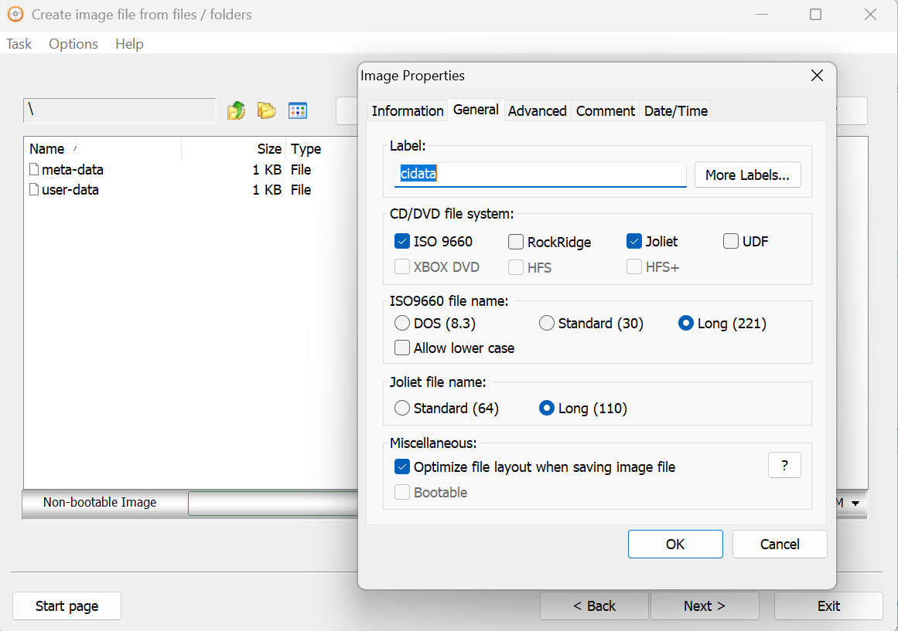
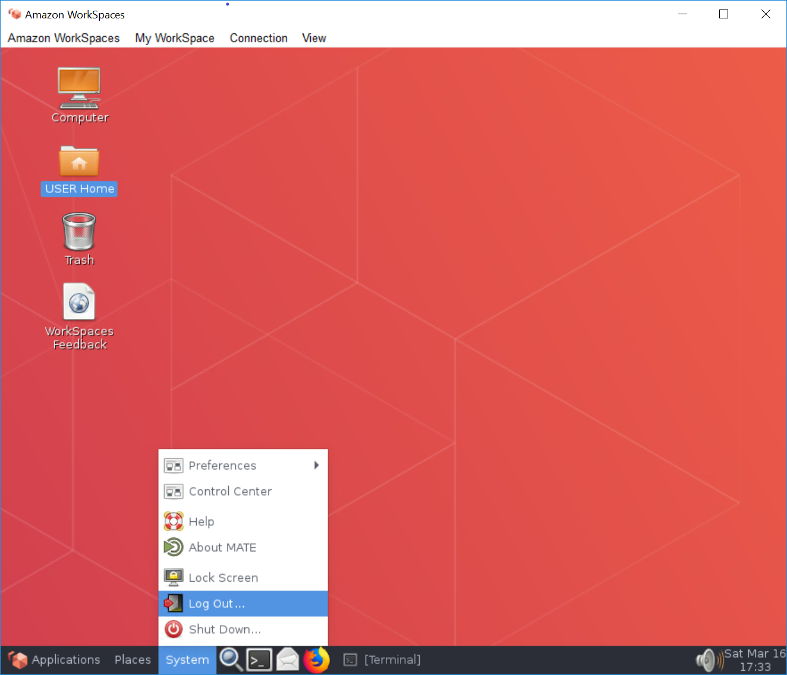
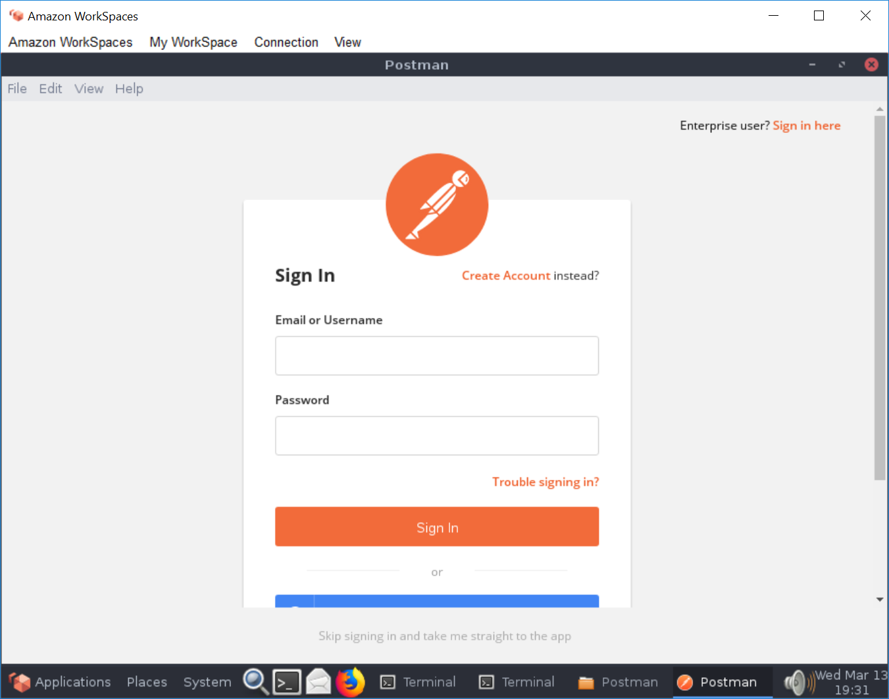
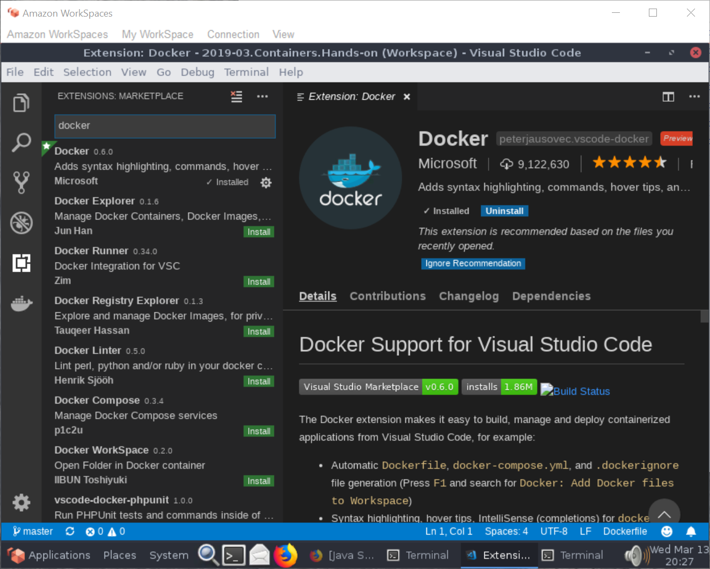

# Setup an Amazon Linux Developer VM on premises

Setup instruction for software development - Copyright (c) 2019-2025 by Alisson Sol

## 01) Getting the Amazon Linux up and running

This is an update of a previous effort that used [Amazon WorkSpaces](https://github.com/alissonsol/archive/tree/main/WorkSpaces/2019-03.WorkSpaces.AmazonLinux.setup). This time, will use Amazon Linux under Hyper-V. See [requirements and limitations](https://docs.aws.amazon.com/linux/al2023/ug/hyperv-supported-configurations.html).

Ready? Proceed to the download [site](https://docs.aws.amazon.com/linux/al2023/ug/outside-ec2-download.html). Click the link to the [cnd.amazonlinux.com](https://cdn.amazonlinux.com/al2023/os-images/latest/), and get to the `hyperv` subfolder. There will be large `vhdx.zip` file, which is the one to download. A hint here: you can see by the long file name that this image is being constantly updated. I usually keep the ZIP file copied nearby. Then, I unzip the content, while copying to `C:\ProgramData\Microsoft\Windows\Virtual Hard Disks`. Used to be `C:\Users\Public\Documents\Hyper-V\Virtual hard disks`, but why would Microsoft keep locations stable when those updating Markdown files need a job?!

Before proceeding, you need to create a file `seed.iso`, with the volume label `cidata`. This file defines the default password for the user during the first login, as per instructions [here](https://docs.aws.amazon.com/linux/al2/ug/amazon-linux-2-virtual-machine.html). Which would be reasonable instructions, if someone using Windows Hyper-V had the Linux and macOS tools! A possible solution is to [Download and install the Windows ADK](https://learn.microsoft.com/en-us/windows-hardware/get-started/adk-install), using the command line tool `oscdimg`, which has clear command line [parameters](https://learn.microsoft.com/en-us/windows-hardware/manufacture/desktop/oscdimg-command-line-options). Instead, I used AnyBurn, which you can download for free from [AnyBurn.com](https://anyburn.com/). You then just add the files `meta-data` and `user-data` with the configurations of your choice, and don't forget the volume label (see picture).



Luckily, this repository has examples for the `-data` files, and a sample `seed.iso` that can be used (see the default password for the default user `ec2-user` in the `user-data` file). You will be asked to change the defined password for the default user after the first login. This is likely not the big security risk you will face today!

Next, I go to the `Hyper-V Manager` and selecting the local server, righ-click and select the menu `New` -> `Virtual Machine...`:
- Under `Specify Name and Location`, enter whatever name you prefer (suggested: `AmazonLinux`), and leave the default location.
- Under `Specify Generation`, select `Generation 1`
- Under `Assign Memory`, select the `Startup Memory` (at least 4096, with 8192 or more recommended). Unselect `Use Dynamic Memory for this virtual machine.`
- Under `Configure Networking`, select the `Connection` as `External`.
- Under `Connect Virtual Hard Disk`, select `Use an existing virtual hard disk`. Browse to the file you previously unzipped, and click `Finish`.
- Right-click the new VM and choose `Settings`. In the `Settings` window, under `IDE Controller 1`, choose `DVD Drive`.
- For the DVD drive, choose Image file and then browse to and select the `seed.iso` file.
- Apply the changes and start the VM.

You can now start the VM, as per the instructions to [Run AL2 as a virtual machine on premises](https://docs.aws.amazon.com/linux/al2/ug/amazon-linux-2-virtual-machine.html).

Before proceeding, check network connectivity. A simple command like `ping 8.8.8.8` should check if the network is connected. Then `ping google.com` would check if the DNS service client stack is working. If something is not working, check if the machine got an IP address with the `ifconfig` command. If that is not working, you may try to shutdown the machine (`sudo shutdown now`) and change the settings for the `Network Adapter` virtual switch (more [here](https://learn.microsoft.com/en-us/windows-server/virtualization/hyper-v/get-started/create-a-virtual-switch-for-hyper-v-virtual-machines), but going deeper is beyond the scope of this document).

## 02) Install the JDK

The Java toolk to be used in the [Amazon Corretto](https://docs.aws.amazon.com/corretto/)

```
$ sudo rpm --import https://yum.corretto.aws/corretto.key
$ sudo curl -L -o /etc/yum.repos.d/corretto.repo https://yum.corretto.aws/corretto.repo
$ sudo yum install -y java-21-amazon-corretto-devel
$ java -version
$ javac -version
$ export JAVA_HOME=/etc/alternatives/java_sdk
```

You may also benefit from adding JAVA_HOME to /etc/bashrc

## 03) Install .NET Core

For those who want to work on .NET, following instructions to [Install .NET Core SDK on Linux CentOS / Oracle x6](https://dotnet.microsoft.com/download/linux-package-manager/centos/sdk-current)

Basic commands are:
```
$ sudo rpm -Uvh https://packages.microsoft.com/config/centos/8/packages-microsoft-prod.rpm
$ sudo yum -y update
$ sudo yum -y install dotnet-sdk-8.0
$ dotnet --version
```

## 04) Install Git

For version control, I use git. It was there already in the cloud desktop. Just in case, here are the install instructions:

```
$ sudo yum -y install git
$ git --version
```
## TODO

## 05) Install Docker
  
Allow work with containers.

Basic commands are:
```
$ sudo yum -y install docker
$ sudo docker --version
```

And in order to avoid having to run docker with `sudo` all the time:
```
$ sudo groupadd docker
$ sudo usermod -aG docker $USER
```

It is recommended that you follow the [Post-installation steps for Linux])(https://docs.docker.com/install/linux/linux-postinstall/). Mainly, that you logout and login again, and then set docker to start after reboots and test it starting a Hello World instance.

```
$ sudo systemctl enable docker 
$ sudo systemctl start docker
$ docker run hello-world
```

If that last command fails, remember to logout (menu System->Log Out) and connect again.



Depending on images you will use during development, you may need to sign-up for an account in the [Docker Hub registry](https://hub.docker.com/signup). It is recommended to proactively do that.

## 06) Install Docker Compose
  
Follow the instructions to [Install Docker Compose](https://docs.docker.com/compose/install/).

Basic commands are:
```
$ sudo curl -L "https://github.com/docker/compose/releases/download/1.23.2/docker-compose-$(uname -s)-$(uname -m)" -o /usr/local/bin/docker-compose
$ sudo chmod +x /usr/local/bin/docker-compose
$ sudo ln -s /usr/local/bin/docker-compose /usr/bin/docker-compose
$ docker-compose --version
```

## 07) Install Postman

Postman really helps when developing APIs, sites, testing authentication, etc. Download [Postman](https://www.getpostman.com/downloads/). Then uncompress, add to a folder and optionally add that folder to the PATH. In order to check the installation, start Postman and create or sign-up to your account (picture below).



## 08) Install Traefik

The software NLB used for experiments, and configuration.

Follow article [How To Use Traefik as a Reverse Proxy for Docker Containers on CentOS 7](https://www.digitalocean.com/community/tutorials/how-to-use-traefik-as-a-reverse-proxy-for-docker-containers-on-centos-7)

# 09) Install Maven

The build package to be used to build the projects. Install commands are:

```
$ sudo yum -y install maven
$ mvn -version
```

# 10) Install Visual Studio Code

Basic commands are:
```
$ sudo rpm --import https://packages.microsoft.com/keys/microsoft.asc
$ sudo sh -c 'echo -e "[code]\nname=Visual Studio Code\nbaseurl=https://packages.microsoft.com/yumrepos/vscode\nenabled=1\ngpgcheck=1\ngpgkey=https://packages.microsoft.com/keys/microsoft.asc" > /etc/yum.repos.d/vscode.repo'
$ sudo yum -y install code
```

Follow instructions for [Managing Extensions in Visual Studio Code](https://code.visualstudio.com/docs/editor/extension-gallery) and install useful extensions, like:
- Maven for Java
- Docker (picture below)



# Test if everything works...

At the end of the process, it is required to at least logout and login again, so the membership credentials are refreshed.

Would recommend also a reboot, in order to make sure configuration is persisted.
```
$ sudo shutdown -r now
```

After the reboot and reconnection, open a terminal and check every package installed is still accessible.

```
$ javac -version
$ dotnet --version
$ git --version
$ docker --version
$ docker-compose --version
$ mvn -version
$ code
```

You should now have a Visual Studio Code window open. The cloud desktop is ready for coding.