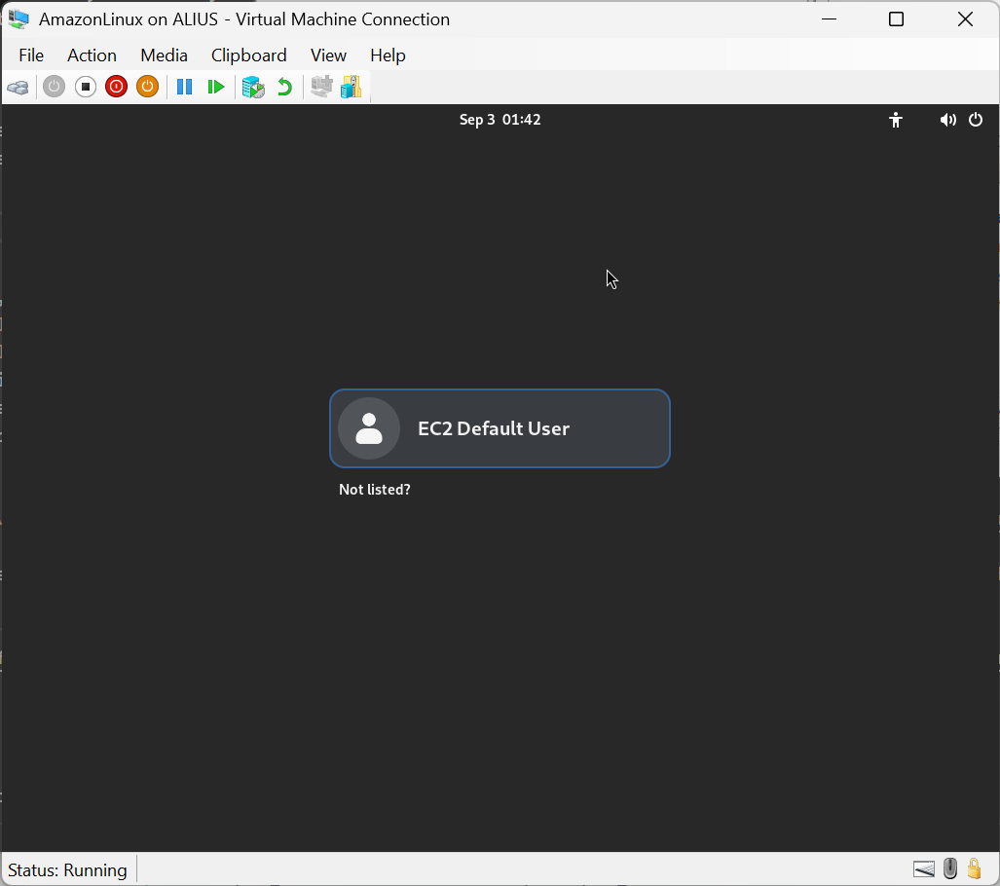

# Setup an Amazon Linux Developer VM on premises

Setup instruction for software development - Copyright (c) 2019-2025 by Alisson Sol

## 01) Getting the Amazon Linux up and running

This is an update of a previous effort that used [Amazon WorkSpaces](https://github.com/alissonsol/archive/tree/main/WorkSpaces/2019-03.WorkSpaces.AmazonLinux.setup). This time, will use Amazon Linux under Hyper-V. See [requirements and limitations](https://docs.aws.amazon.com/linux/al2023/ug/hyperv-supported-configurations.html).

Ready? Proceed to the download [site](https://docs.aws.amazon.com/linux/al2023/ug/outside-ec2-download.html). Click the link to the [cnd.amazonlinux.com](https://cdn.amazonlinux.com/al2023/os-images/latest/), and get to the `hyperv` subfolder. There will be large `vhdx.zip` file, which is the one to download. A hint here: you can see by the long file name that this image is being constantly updated. I usually keep the ZIP file copied nearby. Then, I unzip the content, while copying to `C:\ProgramData\Microsoft\Windows\Virtual Hard Disks`. Used to be `C:\Users\Public\Documents\Hyper-V\Virtual hard disks`, but why would Microsoft keep locations stable when those updating Markdown files need a job?!

Before proceeding, you need to create a file `seed.iso`, with the volume label `cidata`. This file defines the default password for the user during the first login, as per instructions [here](https://docs.aws.amazon.com/linux/al2/ug/amazon-linux-2-virtual-machine.html). Which would be reasonable instructions, if someone using Windows Hyper-V had the Linux and macOS tools! A possible solution is to [Download and install the Windows ADK](https://learn.microsoft.com/en-us/windows-hardware/get-started/adk-install), using the command line tool `oscdimg`, which has clear command line [parameters](https://learn.microsoft.com/en-us/windows-hardware/manufacture/desktop/oscdimg-command-line-options). Instead, I used AnyBurn, which you can download for free from [AnyBurn.com](https://anyburn.com/). You then just add the files `meta-data` and `user-data` with the configurations of your choice, and don't forget the volume label (see picture).


Luckily, this repository has examples for the `-data` files, and a sample `seed.iso` that can be used (see the default password for the default user `ec2-user` in the `user-data` file). You will be asked to change the defined password for the default user after the first login. This is likely not the big security risk you will face today!

Next, I go to the `Hyper-V Manager` and selecting the local server, righ-click and select the menu `New` -> `Virtual Machine...`:
- Under `Specify Name and Location`, enter whatever name you prefer (suggested: `AmazonLinux`), and leave the default location.
- Under `Specify Generation`, select `Generation 2`
- Under `Assign Memory`, select the `Startup Memory` (at least 8192, with 16384 or more recommended). Unselect `Use Dynamic Memory for this virtual machine.`
- Under `Configure Networking`, select the `Connection` as `External`.
- Under `Connect Virtual Hard Disk`, select `Use an existing virtual hard disk`. Browse to the file you previously unzipped, and click `Finish`.
- Right-click the new VM and choose `Settings`, to adjust configuration.
  - In the `Settings` window, under `SCSI Controller`, choose `DVD Drive`, then `Add`. Choose `Image file` and then browse to the `seed.iso` file and select it.
  - Under the `Security` section, unselect the `Enable Secure Boot` option.

Apply the changes. You can now start the VM, as per the instructions to [Run AL2 as a virtual machine on premises](https://docs.aws.amazon.com/linux/al2/ug/amazon-linux-2-virtual-machine.html). Unless you changed the defaults in the file `user-data`, you will login with the `ec2-user` account and the password defined there, and be promptly asked to change the password.

Before proceeding, check network connectivity. A simple command like `ping 8.8.8.8` should check if the network is connected. Then `ping google.com` would check if the DNS service client stack is working.

If something is not working, check if the machine got an IP address with the `ifconfig` command. If that is not working, you may try to shutdown the machine (`sudo shutdown now`) and change the settings for the `Network Adapter` virtual switch (more [here](https://learn.microsoft.com/en-us/windows-server/virtualization/hyper-v/get-started/create-a-virtual-switch-for-hyper-v-virtual-machines), but going deeper is beyond the scope of this document).

## Get the GUI

Update the system, install the GNOME Desktop environment, and shutdown.

```
sudo dnf update -y
sudo dnf upgrade -y
sudo dnf groupinstall "Desktop" -y
sudo shutdown now
```

This is a great time to create a checkpoint `GUI Installed`. Your system should reboot to a GUI, and you should be able to start a terminal and a browser.



## 02) Install the JDK

The Java toolk to be used in the [Amazon Corretto](https://docs.aws.amazon.com/corretto/)

```
sudo dnf install -y java-21-amazon-corretto-devel
java -version
javac -version
export JAVA_HOME=/etc/alternatives/java_sdk
```

You may also benefit from adding JAVA_HOME to /etc/bashrc

## 03) Install .NET Core

For those who want to work on .NET, following instructions to [Install .NET Core SDK on Linux CentOS / Oracle x6](https://dotnet.microsoft.com/download/linux-package-manager/centos/sdk-current)

Basic commands are:
```
sudo rpm -Uvh https://packages.microsoft.com/config/centos/9/packages-microsoft-prod.rpm
sudo dnf -y update
sudo dnf -y install dotnet-sdk-8.0
dotnet --version
```

## 04) Install Git

For version control, I use git. It was there already in the cloud desktop. Just in case, here are the install instructions:

```
sudo dnf -y install git
git --version
```

## 05) Install Docker
  
Allow work with containers. Hacking the instructions for the [CentOS](https://docs.docker.com/engine/install/centos/#set-up-the-repository). It works around the `$releasever` for the Amazon Linux being different. Also need to pre-install the depenencies (`iptables` and `container-selinux`).

Basic commands are:
```
sudo dnf -y install dnf-plugins-core iptables container-selinux
sudo dnf config-manager --add-repo https://download.docker.com/linux/centos/docker-ce.repo
sudo dnf --releasever=9 -y update
sudo dnf --releasever=9 -y install docker-ce docker-ce-cli containerd.io docker-buildx-plugin docker-compose-plugin
sudo systemctl enable --now docker
sudo docker --version
```

Some cleanup now. First, will remote that docker repo. Otherwise, due to the release version number difference between Amazon Linux and CentOS, you get warning messages when running `dnf` about a not found docker repository (even when not needed). In order to avoid having to run docker with `sudo` all the time, add the current user to the `docker` group. Then, to test, run the `Hello World` application.

```
sudo rm /etc/yum.repos.d/docker-ce.repo
sudo dnf makecache
sudo groupadd docker
sudo usermod -aG docker $USER
newgrp docker
docker run hello-world
```

If that last command fails, remember to logout (menu System->Log Out) and connect again.

Depending on images you will use during development, you may need to sign-up for an account in the [Docker Hub registry](https://hub.docker.com/signup). It is recommended to proactively do that.


# 06) Install Visual Studio Code

Basic commands are:
```
sudo rpm --import https://packages.microsoft.com/keys/microsoft.asc
sudo sh -c 'echo -e "[code]\nname=Visual Studio Code\nbaseurl=https://packages.microsoft.com/yumrepos/vscode\nenabled=1\ngpgcheck=1\ngpgkey=https://packages.microsoft.com/keys/microsoft.asc" > /etc/yum.repos.d/vscode.repo'
sudo dnf -y install code
```

Follow instructions for [Managing Extensions in Visual Studio Code](https://code.visualstudio.com/docs/editor/extension-gallery) and install useful extensions.

# Test if everything works...

At the end of the process, it is required to at least logout and login again, so the membership credentials are refreshed.

Would recommend also a reboot, in order to make sure configuration is persisted.
```
sudo shutdown -r now
```

After the reboot and reconnection, open a terminal and check every package installed is still accessible.

```
javac -version
dotnet --version
git --version
docker --version
code --version
```

You should now be able to start Visual Studio Code (`code`).